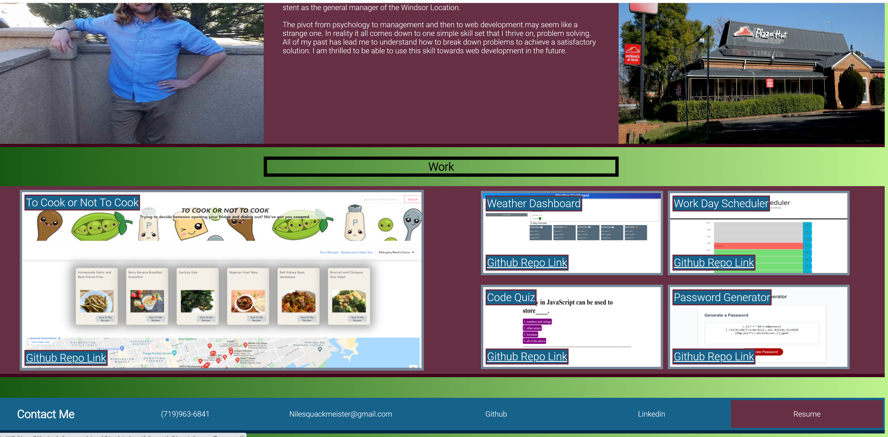
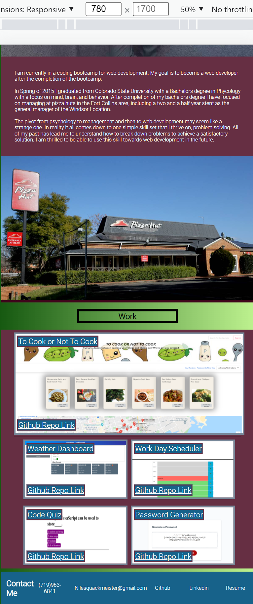
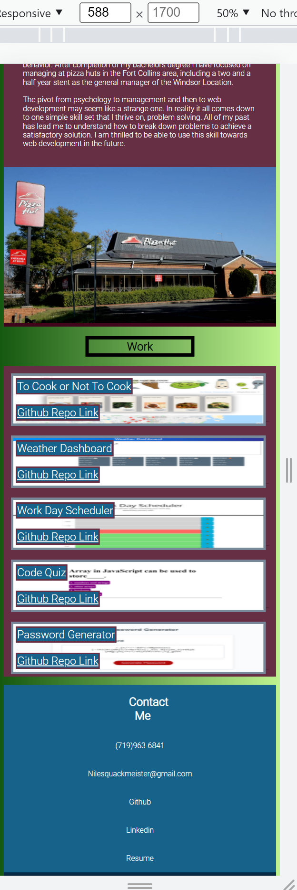

Portfolio Rework
About the project: The goal of this page was to inform people about my work. In the header there is a navigation section to allow people to jump to different parts of the page. Below that there is an about me section where I write a little bit about myself. This section also contains a picture of me. Below that there are pictures that link to my work. Each project also has a link to the corresponding github repo. At the bottom of the page there is a contact me section. This links to different ways that potential employers would be able to contact me. Part of the focus on the project was to demonstrate my mastery of HTML and CSS. This includes the way in which the page changes based on the view port. I also wanted to add effects on hover to give the page a more lively feel. While I think it demonstrates my mastery of these languages I am also aware that it demonstrates my lack of artistic ability.

Built Using: HTML CSS This page was built with accessibility as a main focus

Usage: The only thing the user will need to do is to open the webpage. The user will be able to use the nav section to navigate throughout the page. The user will also be able to click on the pictures of my work to navigate to webpages containing my work. At the bottom of the page the user is able to click on the contact me links to open up different interfaces to contact me.

Images:
This first image demonstrates what the page looks like upon load with a screen resolution of greater than 998px.

This second image demonstrates what the bottom of the page looks like when the screen resolution of greater than 998px. It also shows the hover effect on the contact links.

This third image shows what the bottom of the page looks like when the screen resolution is between 640px and 998px. 

This forth image shows what the bottom of the page looks like when the screen resolution is less than 640px.

The deployed website can be found at: https://nileshachmeister.github.io/updated-portfolio-week-8/